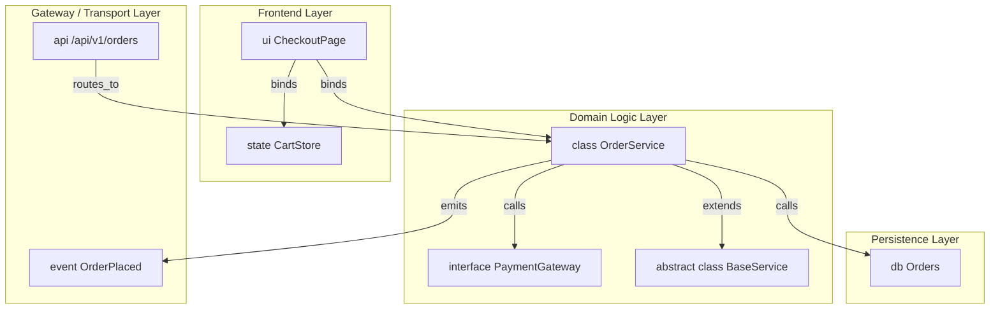
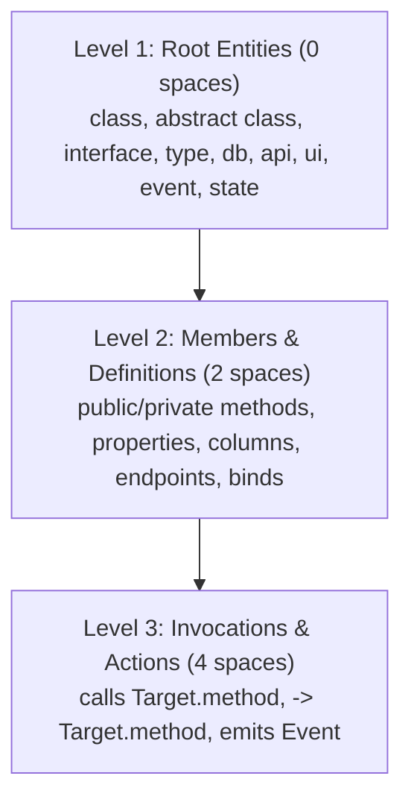
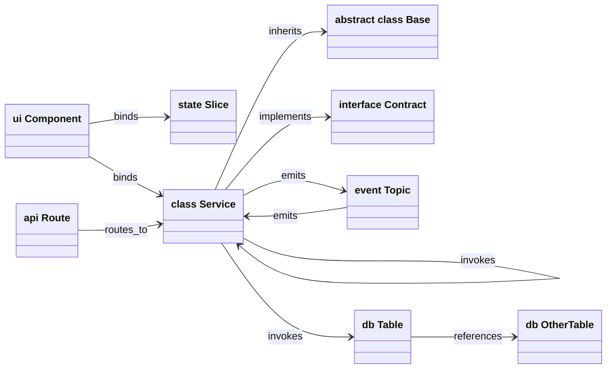
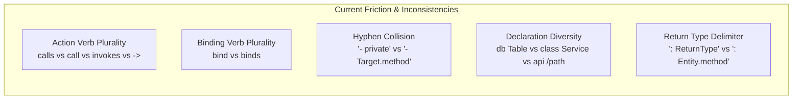

# Draftr Specification: Object Model, Syntax & Grammar

> **Status:** Working Draft (v0.1.4 Baseline)  
> **Purpose:** Comprehensive formal documentation of all supported entity types ("objects"), syntax patterns, relationship edges, formatting hierarchies, and typing ergonomics in Draftr (`.draftr`). This document serves as the foundation for language consolidation, taxonomy refinement, and grammar specification.

---

## Table of Contents

1. [Executive Summary & Architectural Philosophy](#1-executive-summary--architectural-philosophy)
2. [Entity Taxonomy Matrix](#2-entity-taxonomy-matrix)
3. [The 3-Tier Indentation Hierarchy](#3-the-3-tier-indentation-hierarchy)
4. [Exhaustive Object Specifications](#4-exhaustive-object-specifications)
   - [4.1 `class` (Domain Entity / Backend Service)](#41-class-domain-entity--backend-service)
   - [4.2 `abstract class` (Polymorphic Base Service)](#42-abstract-class-polymorphic-base-service)
   - [4.3 `interface` (Contract Specification)](#43-interface-contract-specification)
   - [4.4 `type` (Type Alias / DTO / Value Object)](#44-type-type-alias--dto--value-object)
   - [4.5 `db` (Database Table / Relational Model)](#45-db-database-table--relational-model)
   - [4.6 `api` (REST API Route Group)](#46-api-rest-api-route-group)
   - [4.7 `ui` (User Interface Component Tree)](#47-ui-user-interface-component-tree)
   - [4.8 `event` (Pub/Sub Event Topic)](#48-event-pubsub-event-topic)
   - [4.9 `state` (Client State Store Slice)](#49-state-client-state-store-slice)
5. [Relationship & Edge Topology](#5-relationship--edge-topology)
6. [Modifiers & Typing Ergonomics](#6-modifiers--typing-ergonomics)
7. [Architectural Linter Constraints](#7-architectural-linter-constraints)
8. [Syntax Inconsistencies & Consolidation Proposals](#8-syntax-inconsistencies--consolidation-proposals)

---

## 1. Executive Summary & Architectural Philosophy

Draftr is an **Architecture-as-Code (AaC)** specification language. It allows developers, architects, and AI agents to define end-to-end full-stack software architectures in a terse, indentation-delimited format. 

### Key Principles

1. **Human Readability First**: An outline format without excessive punctuation (no mandatory semicolons, brackets, or commas).
2. **Speed & Ergonomics**: Fast typing shortcuts (`+` expands to `public `, `->` expands to `calls ` or `binds `).
3. **Dual Interpretation**:
   - **Text Representation**: Strict, deterministic outline grammar.
   - **Graph Representation**: Automatic extraction into nodes, members, and directional relationship edges (rendered in interactive canvas, Mermaid diagrams, or scaffolded code).
4. **Architectural Guardrails**: Integrated AST validation and structural linting (e.g., detecting UI-to-DB leaks, circular inheritance, missing interfaces).



---

## 2. Entity Taxonomy Matrix

Draftr supports **9 primary top-level entity types** (the "Objects"):

| Object Keyword | Semantic Category | Primary Role | Canvas Node Color / Type | Allowed Child Members | Outbound Edge Capabilities |
| :--- | :--- | :--- | :--- | :--- | :--- |
| `class` | Domain Logic | Concrete service, manager, or business logic entity | Sky / Blue (`service`) | Properties, Methods, Direct Invocations | `invokes`, `inherits`, `implements`, `emits` |
| `abstract class` | Polymorphism | Abstract base class with partial implementation | Slate / Navy (`service`) | Properties, Methods | `inherits`, `implements`, `invokes` |
| `interface` | Contract | Structural contract defining required signatures | Amber / Orange (`interface`) | Methods, Properties | `inherits` |
| `type` | Domain Modeling | Data transfer object, type alias, or struct | Slate / Gray (`type`) | Properties | None |
| `db` | Persistence | Relational database table or collection | Emerald / Green (`table`) | Columns (with pk, fk, unique) | `references` (via foreign key) |
| `api` | Networking / Gateway | REST API route grouping | Purple / Violet (`api`) | Endpoints (`GET`, `POST`, etc.) | `routes_to` (calls service method) |
| `ui` | Presentation | Frontend screen, component, or view | Rose / Pink (`ui`) | Nested `ui` components, `binds` | `binds` (connects to logic / store) |
| `event` | Messaging / Async | Pub/sub message, domain event, or queue topic | Amber / Yellow (`event`) | Payload type | `emits` (routes to handler) |
| `state` | Client Store | Client-side state slice (Zustand, Redux, etc.) | Cyan / Teal (`state`) | State fields | None |

---

## 3. The 3-Tier Indentation Hierarchy

The Draftr DSL enforces a clean, predictable 3-level indentation tree. Indentation can be expressed as **2 spaces** or **1 tab** per level.

```
Level 1 (0 spaces): [Entity Declaration]
  Level 2 (2 spaces): [Member / Property / Endpoint / Binding]
    Level 3 (4 spaces): [Invocations / Action Steps / Direct Calls]
```

### Hierarchy Diagram



### Visual Code Example

```draftr
// LEVEL 1: Top-Level Entities (0 spaces)
class OrderService extends BaseService implements IOrderProcessor

  // LEVEL 2: Members, Properties & Method Declarations (2 spaces)
  public orderCounter: number
  private apiKey: string
  public process(orderId: string): boolean

    // LEVEL 3: Invocations, Actions & Calls (4 spaces)
    calls PaymentGateway.charge
    calls InventoryService.reserve
    emits OrderProcessed
```

---

## 4. Exhaustive Object Specifications

### 4.1 `class` (Domain Entity / Backend Service)

Represents a concrete domain service, controller, utility, or business logic model.

#### Formal Syntax
```draftr
class <ClassName> [extends <SuperClass>] [implements <Interface1>[, <Interface2>...]]
  [<visibility>] <propName>: <Type>
  [<visibility>] <methodName>([<paramName>: <paramType>...]): <ReturnType> [-> <InlineTarget>]
    calls <TargetEntity>[.<targetMethod>]
    -> <TargetEntity>[.<targetMethod>]
    emits <EventName>
  calls <TargetEntity>
  binds <TargetEntity>
```

#### Supported Member Formats
| Member Form | Example | Generated Graph Element |
| :--- | :--- | :--- |
| **Property** | `public id: string` | Property entry inside class node |
| **Property (Shortcut)** | `+ id: string` | Property entry inside class node |
| **Private Property** | `- secret: string` | Private property inside class node |
| **Method** | `public run(): void` | Method signature inside class node |
| **Method (Shortcut)** | `+ run(id: string): boolean` | Method signature inside class node |
| **Inline Invocation** | `+ pay(): void -> Bank.transfer` | Method signature + `invokes` edge |
| **Level-3 Invocation** | `    calls Bank.transfer` | `invokes` edge from method to `Bank.transfer` |
| **Level-3 Arrow Call** | `    -> Bank.transfer()` | `invokes` edge from method to `Bank.transfer` |
| **Level-2 Direct Call** | `  calls LoggerService` | `invokes` edge from class to `LoggerService` |

#### Full Code Example
```draftr
class OrderService extends BaseService implements IAuditable
  public id: string
  private encryptionKey: string
  public checkout(cartId: string, amount: number): OrderConfirmation
    calls PaymentService.charge
    calls InventoryService.decrementStock
    emits OrderCompleted
```

---

### 4.2 `abstract class` (Polymorphic Base Service)

Represents an inheritable base class that provides shared state or default functionality. Cannot be directly instantiated.

#### Formal Syntax
```draftr
abstract class <ClassName> [extends <SuperClass>] [implements <Interface1>[, <Interface2>...]]
  [<visibility>] <propName>: <Type>
  [<visibility>] <methodName>([<params>]): <ReturnType>
```

#### Full Code Example
```draftr
abstract class BaseService
  protected logger: LoggerInstance
  public initialize(): void
  public getHealth(): HealthStatus
```

---

### 4.3 `interface` (Contract Specification)

Defines a strict structural contract. Implementing classes must implement all defined methods and match signature return types.

#### Formal Syntax
```draftr
interface <InterfaceName> [extends <SuperInterface>]
  [+] <propName>: <Type>
  [+] <methodName>([<params>]): <ReturnType>
```

#### Full Code Example
```draftr
interface PaymentGateway
  + authorize(token: string, amount: number): boolean
  + refund(transactionId: string): RefundReceipt
```

---

### 4.4 `type` (Type Alias / DTO / Value Object)

Defines a data shape, transfer object, or payload without methods or executable behavior.

#### Formal Syntax
```draftr
type <TypeName>
  [+] <fieldName>: <Type>
```

#### Full Code Example
```draftr
type OrderPayload
  + orderId: string
  + customerEmail: string
  + items: OrderItem[]
  + totalAmount: number
```

---

### 4.5 `db` (Database Table / Relational Model)

Represents a persistent relational database table or document collection.

#### Formal Syntax
```draftr
db <TableName>
  [+] <columnName>: <DataType> [pk] [unique] [fk [-> <TargetTable>.<targetColumn>]]
```

#### Supported Column Modifiers
| Modifier | Purpose | Example |
| :--- | :--- | :--- |
| `pk` | Primary key constraint | `+ id: uuid pk` |
| `unique` | Unique constraint | `+ email: string unique` |
| `fk` | Foreign key reference | `+ user_id: uuid fk -> Users.id` |
| `-> Target.col` | Explicit foreign key relationship edge | Generates `references` relationship edge |

#### Full Code Example
```draftr
db Users
  + id: uuid pk
  + email: string unique
  + created_at: timestamp

db Orders
  + id: uuid pk
  + user_id: uuid fk -> Users.id
  + total_price: number
  + status: string
```

---

### 4.6 `api` (REST API Route Group)

Defines HTTP REST gateway routing, paths, payloads, and handlers.

#### Formal Syntax
```draftr
api <BasePath>
  [+] <HTTP_VERB> <subPath>([<RequestPayload>]): <ResponsePayload> [-> <TargetService>.<targetMethod>]
```

#### Supported HTTP Verbs
- `GET`
- `POST`
- `PUT`
- `DELETE`
- `PATCH`

#### Full Code Example
```draftr
api /api/v1/orders
  + POST /create(CreateOrderDto): OrderResponse -> OrderService.checkout
  + GET /:id(): OrderDetails -> OrderService.getOrder
  + DELETE /:id(): void -> OrderService.cancelOrder
```

---

### 4.7 `ui` (User Interface Component Tree)

Defines frontend visual hierarchy, pages, and components, and binds them to application services or state slices.

#### Formal Syntax
```draftr
ui <RootComponentName>
  binds <ServiceName>
  binds <StateSliceName>
  ui <ChildComponentName>
    binds <ServiceName>
```

#### Full Code Example
```draftr
ui CheckoutPage
  binds OrderService
  binds CartStore
  ui OrderSummaryWidget
  ui PaymentCardForm
    binds PaymentService
```

> [!WARNING]
> **Architectural Guardrail (`ui-db-leak`):** A UI component is strictly forbidden from binding or calling a `db` table directly (`binds UsersTable` triggers an architectural error). All access must pass through a `class` service.

---

### 4.8 `event` (Pub/Sub Event Topic)

Represents an asynchronous domain message or event stream.

#### Formal Syntax
```draftr
event <EventName>[(<PayloadType>)] [-> <TargetHandler>.<targetMethod>]
```

#### Full Code Example
```draftr
event OrderPlaced(OrderPayload) -> NotificationService.sendEmail
event PaymentFailed(PaymentError) -> AlertManager.notify
```

---

### 4.9 `state` (Client State Store Slice)

Represents a frontend reactive store slice (e.g. Pinia, Redux, Zustand).

#### Formal Syntax
```draftr
state <SliceName>
  [+] <fieldName>: <Type>
```

#### Full Code Example
```draftr
state CartState
  + items: CartItem[]
  + subtotal: number
  + isSubmitting: boolean
```

---

## 5. Relationship & Edge Topology

When Draftr files are parsed, interactions between objects produce **7 distinct edge types**:



### Relationship Edge Summary Table

| Edge Type | Origin Entity | Target Entity | Trigger Syntax | Visual Graph Appearance |
| :--- | :--- | :--- | :--- | :--- |
| `invokes` | `class`, `method` | `class`, `method`, `db` | `calls Target.method`, `-> Target.method`, `invokes Target` | Solid directed arrow |
| `binds` | `ui` | `class`, `state` | `binds TargetEntity` | Dashed blue line |
| `references` | `db` column | `db` column | `fk -> OtherTable.col` | Solid emerald line with fork |
| `inherits` | `class` | `class`, `abstract class` | `extends TargetClass` | Solid line with hollow triangle |
| `implements` | `class` | `interface` | `implements TargetInterface` | Dashed line with hollow triangle |
| `emits` | `class`, `event` | `event`, `class` | `emits EventName`, `event E -> Service.method` | Dotted amber arrow |
| `routes_to` | `api` endpoint | `class` method | `+ GET /path: Type -> Service.method` | Purple dashed line |

---

## 6. Modifiers & Typing Ergonomics

### Visibility Modifiers

Draftr supports both natural word keywords and rapid single-character shortcuts:

| Keyword | Shortcut | Scope | Theme Highlight Color |
| :--- | :--- | :--- | :--- |
| `public` | `+` | Accessible anywhere | Blue / Emerald |
| `private` | `-` | Restricted to containing entity | Blue / Emerald |
| `protected` | `#` | Accessible to self and subclasses | Blue / Emerald |
| `readonly` | — | Immutable property | Blue / Emerald |
| `override` | — | Explicitly overrides inherited method | Blue / Emerald |

### Typing Shortcuts & Trigger Expansions

In both the Web App and VS Code Extension:

| Key Typed at Line Start | Auto-Expands To | Purpose |
| :--- | :--- | :--- |
| `+ ` | `public ` | Declare public property or method |
| `- ` | `private ` | Declare private property or method |
| `# ` | `protected ` | Declare protected property or method |
| `-> ` (under class / method) | `calls ` | Write an invocation target |
| `-> ` (under ui) | `binds ` | Bind a service or state slice |

---

## 7. Architectural Linter Constraints

The built-in Draftr linter enforces domain integrity and architectural rules across all objects:

| Rule Code | Severity | Affected Objects | Rule Condition |
| :--- | :--- | :--- | :--- |
| `ui-db-leak` | **Error** | `ui`, `db` | A `ui` component attempts to bind or call a `db` table directly without passing through a `class` service layer. |
| `circular-inheritance`| **Error** | `class`, `abstract class` | An inheritance cycle is detected (e.g. `A extends B` and `B extends A`). |
| `missing-interface` | **Error** | `class`, `interface` | A class specifies `implements NonExistentInterface`. |
| `unimplemented-method`| **Error** | `class`, `interface` | A class declares `implements Interface` but fails to implement one or more methods specified by the interface. |
| `signature-mismatch` | **Warning** | `class`, `interface` | An implementing class implements a required method with a mismatched return type. |
| `missing-call-target` | **Warning** | `class`, `method` | An invocation statement (`calls Foo.bar`) targets a class or method that does not exist in the project. |
| `missing-foreign-key-target` | **Warning** | `db` | A foreign key references a non-existent table or column (`fk -> MissingTable.id`). |
| `orphan-entity` | **Info** | All entities | An entity is declared but is never referenced, called, or bound anywhere in the architecture. |

---

## 8. Syntax Inconsistencies & Consolidation Proposals

As we work on **refining and consolidating language, terms, and syntax**, here is the inventory of current friction points:



### 1. Action Verb Duality (`calls` vs `call` vs `invokes` vs `->`)
* **Current State:** The parser accepts `calls`, `invokes`, and `->` interchangeably. The linter internally calls them `invokes`.
* **Consolidation Proposal:** Standardize on **`calls`** as the primary human keyword and **`->`** as the rapid symbol shorthand. Deprecate `invokes`.

### 2. Binding Verb Duality (`bind` vs `binds`)
* **Current State:** Both `bind` and `binds` are accepted under UI components.
* **Consolidation Proposal:** Standardize on **`binds`** (matches third-person verb form like `calls`, `extends`, `implements`, `emits`).

### 3. Sub-Bullet `-` Collision with Private Modifier `-`
* **Current State:** Under a method, `- Target.method` is interpreted as an invocation. However, at level 2, `- secret: string` is a private modifier.
* **Consolidation Proposal:** Discourage leading `-` for method calls; prefer `calls Target.method` or `-> Target.method`. Reserve `-` strictly for private visibility.

### 4. API Endpoints vs Method Signatures
* **Current State:** Methods use `name(args): ReturnType`, while API routes use `VERB /path(Payload): Response -> Service.method`.
* **Consolidation Proposal:** Maintain HTTP verb prefixes for `api`, but harmonize the arrow syntax so that all handler linkage consistently uses `-> Target.method`.

### 5. Entity Reference Chips
* **Current State:** Return types like `public start(): Pi.help` create dependencies, while `calls Pi.help` creates execution edges.
* **Consolidation Proposal:** Clarify in the object model that `Type.member` in return positions denotes a **data contract**, while `calls Type.member` denotes an **execution invocation**.
